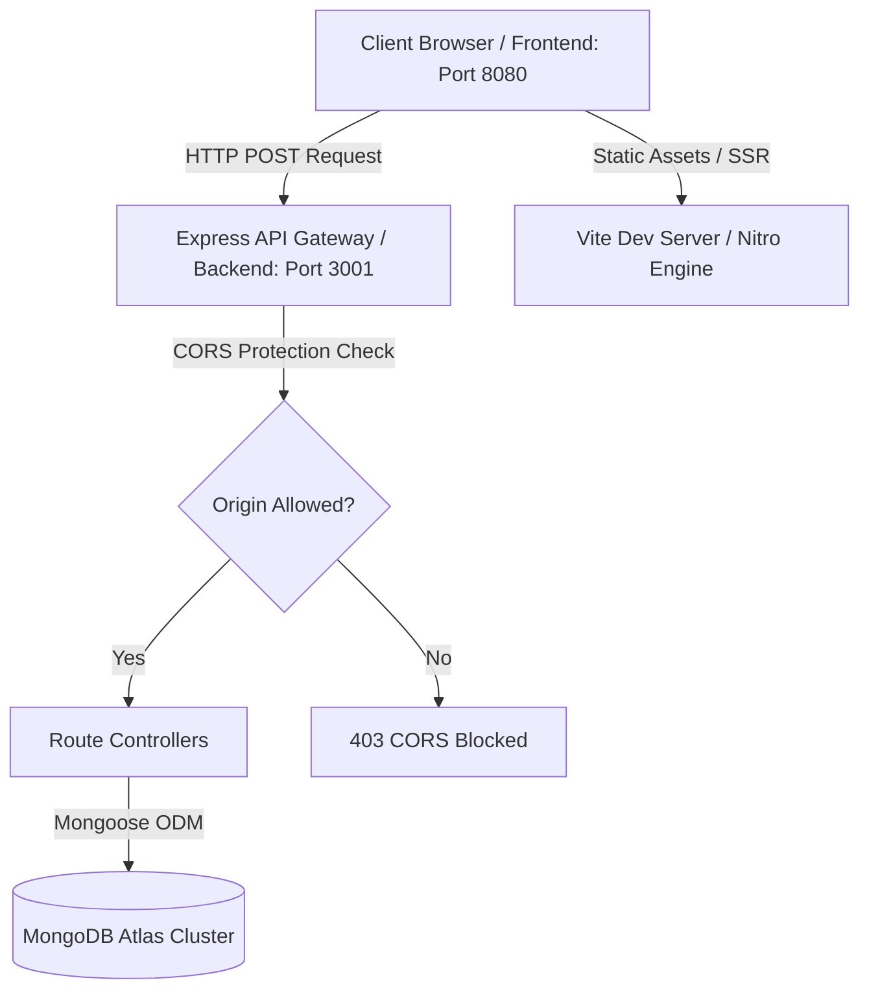

# Hiveron Web Application

An industry-grade, full-stack application for **Hiveron**—a premium natural athletic energy gel brand. The application consists of a high-performance, responsive React frontend powered by **TanStack Start** and **Vite**, and a secure, light-weight database-connected REST API backend powered by **Express.js** and **Mongoose**.

---

## Table of Contents

1. [System Architecture](#system-architecture)
2. [Key Features](#key-features)
3. [Technology Stack](#technology-stack)
4. [Project Structure](#project-structure)
5. [Getting Started](#getting-started)
   - [Prerequisites](#prerequisites)
   - [Backend Environment Setup](#backend-environment-setup)
   - [Installation](#installation)
   - [Running the Application](#running-the-application)
6. [API Specification](#api-specification)
   - [POST `/api/waitlist`](#post-apiwaitlist)
   - [POST `/api/contact`](#post-apicontact)
   - [GET `/health`](#get-health)
7. [Production Deployment](#production-deployment)
8. [Code Quality & Linting](#code-quality--linting)

---

## System Architecture



---

## Key Features

- **Responsive Landing Page**: Sleek, honey/amber themed glassmorphic UI showcasing product value, raw honey formula, and comparison metrics.
- **Waitlist Form System**: Allows potential customers to register, performing automatic duplicates checks on email entries.
- **Contact Desk**: A feedback/support system enabling direct messaging into the administration pipeline.
- **Database Integration**: Dynamic schemas and persistence using MongoDB Atlas.
- **SEO & Performance Optimized**: Utilizes semantic HTML, optimized image sizes, and fast server-side rendering (SSR) capabilities.

---

## Technology Stack

### Frontend

- **Framework**: [TanStack Start](https://tanstack.com/start) (Full-stack React Framework)
- **Routing**: [TanStack Router](https://tanstack.com/router) (Typesafe file-based routing)
- **State Management**: [TanStack Query](https://tanstack.com/query) (React Query)
- **Styling**: [Tailwind CSS](https://tailwindcss.com/)
- **Animation**: [tw-animate-css](https://www.npmjs.com/package/tw-animate-css)
- **Icons**: [Lucide React](https://lucide.dev/)
- **Build Engine**: [Vite](https://vitejs.dev/)

### Backend

- **Server Platform**: Node.js & [Express.js](https://expressjs.com/)
- **Database ODM**: [Mongoose](https://mongoosejs.com/) (MongoDB Integration)
- **Utilities**: CORS protection, Dotenv environmental isolation

---

## Project Structure

```
├── src/
│   ├── assets/              # Optimized static image assets and icons
│   ├── components/          # Reusable UI components
│   │   └── ui/              # Radix UI + Tailwind design tokens
│   ├── hooks/               # Custom React hooks (e.g. useInView)
│   ├── lib/                 # Utility files & API clients
│   ├── routes/              # TanStack Router folder-structure routes
│   │   ├── __root.tsx       # Main page layout structure
│   │   └── index.tsx        # Hiveron Home landing page layout
│   ├── router.tsx           # Router configuration
│   ├── server.ts            # Client-side SSR entry
│   ├── start.ts             # Main bundle entry
│   └── styles.css           # Global Tailwind & Custom UI styles
├── backend/
│   ├── src/
│   │   └── server.js        # Main Express API entrypoint & routes
│   ├── .env.example         # Template for environment configuration
│   ├── package.json         # Backend node scripts & dependencies
│   └── package-lock.json    # Backend locks
├── package.json             # Root-level configuration & dev dependencies
├── tsconfig.json            # Strict TypeScript configuration
└── vite.config.ts           # Vite + TanStack compilation pipeline
```

---

## Getting Started

### Prerequisites

Ensure you have the following software installed:

- **Node.js**: v18.0.0 or higher
- **NPM** or **Bun** package manager
- **MongoDB Atlas Account** (or a local MongoDB instance running)

### Backend Environment Setup

Create an active configuration file for the backend server:

1. Copy the sample environment file in the `backend/` directory:
   ```bash
   cp backend/.env.example backend/.env
   ```
2. Open `backend/.env` and update the database URI and origin parameters:
   ```env
   PORT=3001
   MONGODB_URI=mongodb+srv://<db_user>:<db_password>@<your_cluster_address>.mongodb.net/hiveron
   FRONTEND_ORIGIN=http://localhost:8080
   ```

> [!WARNING]
> Keep your `backend/.env` credentials secure. This file is excluded from repository commits by `.gitignore`.

### Installation

Install packages for both the root (frontend) and backend workspaces:

```bash
# Install root & frontend dependencies
npm install

# Install backend dependencies
cd backend
npm install
cd ..
```

### Running the Application

For development, run both servers simultaneously.

#### 1. Start the Frontend Server (Vite)

From the root workspace directory:

```bash
npm run dev
```

The client dashboard will be available at **`http://localhost:8080`**.

#### 2. Start the Backend Server (Express + MongoDB)

From the `backend/` directory:

```bash
npm run dev
```

The API server will launch at **`http://localhost:3001`**, verifying database connection logs upon successful start.

---

## API Specification

All payloads are exchanged in **JSON** format.

### POST `/api/waitlist`

Registers a user onto the Hiveron Waitlist.

- **Request Body**:
  ```json
  {
    "name": "Alex Mercer",
    "email": "alex.mercer@example.com",
    "phone": "+15550199"
  }
  ```
- **Responses**:
  - **`201 Created`**:
    ```json
    {
      "message": "You have been added to the waitlist.",
      "id": "64b0b14c351f0402b9f3a9e3"
    }
    ```
  - **`400 Bad Request`**: Missing required fields or malformed email.
  - **`409 Conflict`**: Email address already registered.

### POST `/api/contact`

Submits a message through the customer service contact form.

- **Request Body**:
  ```json
  {
    "name": "Jane Doe",
    "email": "jane@example.com",
    "subject": "Product Inquiry",
    "message": "Are Hiveron gels vegan-friendly?"
  }
  ```
- **Responses**:
  - **`201 Created`**:
    ```json
    {
      "message": "Your message has been sent.",
      "id": "64b0b18f351f0402b9f3a9e5"
    }
    ```
  - **`400 Bad Request`**: Missing field constraints or invalid email.

### GET `/health`

Returns the status of the server node.

- **Response**:
  - **`200 OK`**:
    ```json
    {
      "ok": true
    }
    ```

---

## Production Deployment

### Frontend Deployment (Vercel)

The project is optimized for deployment on Vercel using the configured Nitro compiler preset:

```bash
npm run build
```

Upload the build artifacts to your hosting provider using standard CI/CD pipelines.

### Backend Deployment

Ensure standard environment variables (`MONGODB_URI`, `PORT`, `FRONTEND_ORIGIN`) are mapped in the production server environment dashboard, pointing `FRONTEND_ORIGIN` to the production URL of your frontend.

---

## Code Quality & Linting

Keep the project formatted and compliant with rules before creating commits:

- **Lint checks**:
  ```bash
  npm run lint
  ```
- **Auto-formatting (Prettier)**:
  ```bash
  npm run format
  ```
